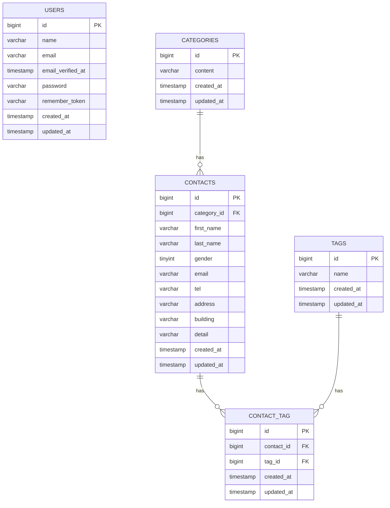

# COACHTECH お問い合わせフォーム

## 概要

お問い合わせフォームと管理画面を備えたWebアプリケーションです。

一般ユーザーはお問い合わせ内容を入力し、確認画面で入力内容を確認・修正したうえでお問い合わせを送信できます。

管理者はユーザー登録・ログイン後、お問い合わせの一覧表示・検索・詳細確認・削除、およびタグの登録・編集・削除を行うことができます。

### 主な機能

- お問い合わせフォーム
- お問い合わせ内容の確認・修正
- お問い合わせ登録
- サンクスページ
- 管理者ユーザー登録
- ログイン・ログアウト
- お問い合わせ一覧表示
- お問い合わせ検索
  - キーワード
  - 性別
  - お問い合わせ種類
  - 日付
- お問い合わせ一覧のページネーション
- お問い合わせ詳細表示
- お問い合わせ削除
- タグによるお問い合わせ分類
- タグの登録・編集・削除
- FormRequestによるバリデーション
- Unit Test
- Feature Test
- CSVエクスポート
- 公開APIによるお問い合わせCRUD

## ER図



### リレーション

- `categories` と `contacts` は1対多
- `contacts` と `tags` は多対多
- `contacts` と `tags` の関連は `contact_tag` 中間テーブルで管理
- `contact_tag` の `contact_id` と `tag_id` の組み合わせにはUNIQUE制約を設定
- ContactまたはTagの削除時、関連する `contact_tag` のレコードもCASCADEで削除

## 環境構築

### 1. リポジトリをクローン

```bash
git clone <GitHubリポジトリURL>
cd contact-form-app
```

`<GitHubリポジトリURL>` は実際のリポジトリURLに置き換えてください。

### 2. Composerパッケージをインストール

```bash
docker run --rm \
    -u "$(id -u):$(id -g)" \
    -v "$(pwd):/var/www/html" \
    -w /var/www/html \
    -e COMPOSER_CACHE_DIR=/tmp/composer_cache \
    laravelsail/php82-composer:latest \
    composer install
```

### 3. `.env`ファイルを作成

```bash
cp .env.example .env
```

`.env`のデータベース接続情報を以下のように設定します。

```env
DB_CONNECTION=mysql
DB_HOST=mysql
DB_PORT=3306
DB_DATABASE=laravel
DB_USERNAME=sail
DB_PASSWORD=password
```

### 4. Dockerコンテナを起動

```bash
./vendor/bin/sail up -d
```

必要に応じてSailのエイリアスを設定します。

bashの場合：

```bash
echo "alias sail='[ -f sail ] && bash sail || bash vendor/bin/sail'" >> ~/.bashrc
source ~/.bashrc
```

zshの場合：

```bash
echo "alias sail='[ -f sail ] && bash sail || bash vendor/bin/sail'" >> ~/.zshrc
source ~/.zshrc
```

### 5. アプリケーションキーを生成

```bash
sail artisan key:generate
```

### 6. フロントエンドの依存パッケージをインストール

```bash
sail npm install
```

### 7. データベースのマイグレーションと初期データ投入

```bash
sail artisan migrate --seed
```

データベースをリセットして作り直す場合：

```bash
sail artisan migrate:fresh --seed
```

### 8. Vite開発サーバーを起動

```bash
sail npm run dev
```

Vite開発サーバーを起動した状態で、ブラウザからアプリケーションへアクセスしてください。

## 使用技術

- PHP 8.2
- Laravel 10.50.3
- MySQL 8.0
- Docker
- Laravel Sail
- phpMyAdmin
- Vite
- Tailwind CSS 3.x
- Laravel Fortify

## テスト

Unit TestおよびFeature Testは以下のコマンドで実行できます。

```bash
sail artisan test
```

コードフォーマットはLaravel Pintで確認できます。

```bash
sail bin pint --test
```

## APIエンドポイント一覧

| Method | Endpoint | 概要 |
| --- | --- | --- |
| GET | /api/v1/contacts | お問い合わせ一覧取得・検索・ページネーション |
| GET | /api/v1/contacts/{id} | お問い合わせ詳細取得 |
| POST | /api/v1/contacts | お問い合わせ新規作成 |
| PUT | /api/v1/contacts/{id} | お問い合わせ更新 |
| DELETE | /api/v1/contacts/{id} | お問い合わせ削除 |

公開APIに認証は不要です。

## 開発環境URL

| サービス | URL |
| --- | --- |
| アプリケーション | http://localhost |
| phpMyAdmin | http://localhost:8080 |

## 作成者

袴田 隼弥